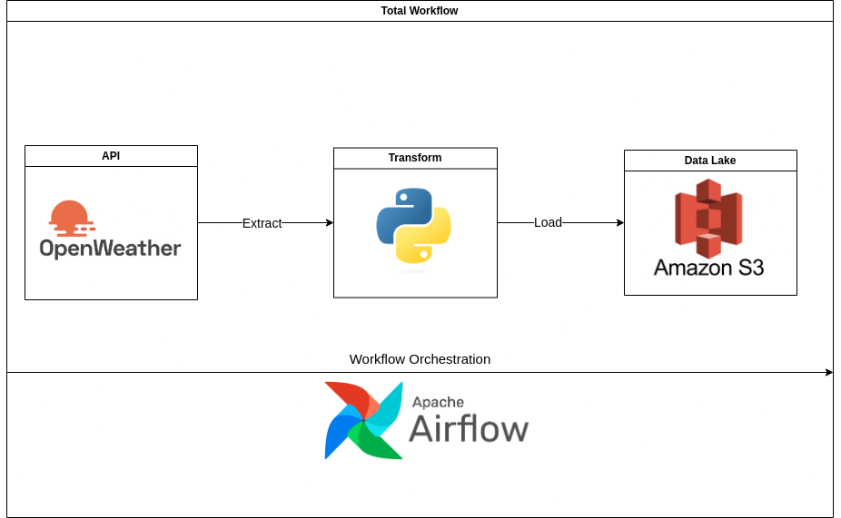

# ETL Pipeline Project
This project creates a pipeline using Airflow and Python. The ETL pipeline first extracts data from the OpenWeatherMap API and transforms the JSON data into a CSV file (semi-structured data to structured data), and loads the CSV File into an AWS S3 Bucket. The architectural structure of the project can be demonstrated as follows:

